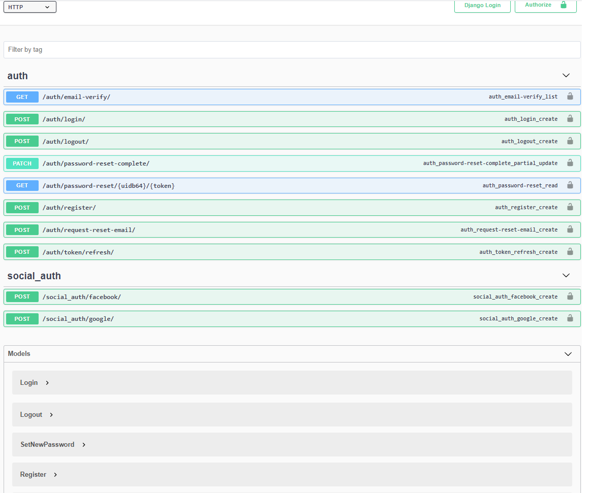

<H1>Expense traker api source code</H1>

Endpoints:

admin/ - admin panel

Head to the root web address. A swagger module will guide you trough all the possible API endpoints with examples as in the image below:

 
Commands:

docker-compose build . -> Build the dependencies and docker image.

docker-compose up -> Run the server in developmnt mode.

docker-compose run --rm app sh -c "python manage.py createsuperuser" -> Create admin.

docker-compose run --rm app sh -c "python manage.py test" -> Run the tests.

 
docker-compose -f docker-compose-deploy.yml up --build -> Run the server in production mode with nginx proxy at port 8080.
